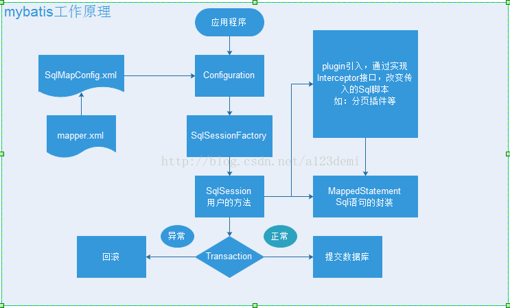
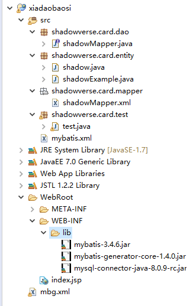
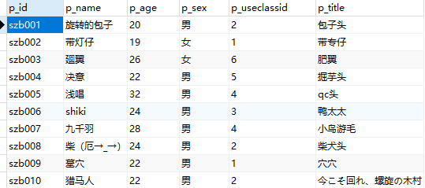
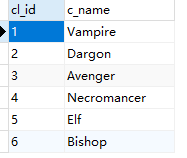
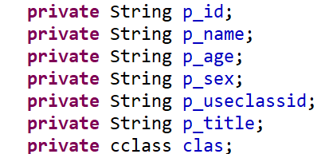

## MyBatis简介:

* **Mybatis本是apache的一个开源项目iBatis，2013年11月迁移到了Github。大家可以去github上下载各个版本，iBatis是一个基于Java的持久层框架，提供的持久层框架包括SQL Maps和Data Access Objects（DAO）。Mybatis消除了几乎所有JDBC代码和参数的手工设置以及对结果集的检索，它可以使用简单的XML或注解用于配置和原始映射，将接口和Java的POJO（Plain Old Java Objects，普通的Java对象）映射城数据库中的记录。Mybatis提供了一种“半自动化”的ORM实现。这相对于Hibernate提供的“全自动化”而言，增加了程序操作人员对sql语句的自由操作和优化**



## Mybatis配置:

Mybatis本身就很小而简单，没有任何第三方依赖，最简单安装只需要两个jar文件和配置几个sql映射文件

* **mybatis-3.4.6.jar**

* **mysql-connector-java-8.0.9-rc.jar**

**xml:**

```xml
	<?xml version="1.0" encoding="UTF-8"?>
	<!DOCTYPE configuration PUBLIC "-//mybatis.org//DTD Config 3.0//EN" "http://mybatis.org/dtd/mybatis-3-config.dtd">
	<configuration>

		<!--1、typeAliases别名处理器，可以为我们的java类型起别名 
			alias后加上你自己命名的名字         type后加实体类路径
		启用别名可以避免每次返回类型变得冗长而复杂
		 -->
		<typeAliases>
			<typeAlias alias="ccc" type="shadowverse.entity.card" />
		</typeAliases>
		
		<!--2、environments，环境，mybatis可以配置多种环境
			其中可以加入environment配置更加具体环境信息 后面的id为便于切换运行环境
			然后再为其配置事务管理器transactionManager			type=JDBC/MANAGED
					以及数据源dataSource		type=POOLED/UNPOOLED/JNDI
		  -->
		<environments default="development">
			<environment id="development">
				<transactionManager type="JDBC" />
				<!-- 配置数据库连接信息 -->
				<dataSource type="POOLED">
					<property name="driver" value="com.mysql.cj.jdbc.Driver" />
					<property name="url" value="jdbc:mysql://localhost:3306/cygames?characterEncoding=utf-8&amp;serverTimezone=UTC&amp;useSSL=FALSE" />
					<property name="username" value="root" />
					<property name="password" value="root" />
				</dataSource>
			</environment>
		</environments>
		
		<mappers>
			<mapper resource="shadowverse/mapper/CardMapper.xml" />
		</mappers>
	</configuration>
```
**! ! ! 注意：这里我用的是mysql 8.0以上版本，所以要配置时区和转码以及ssl等，并且driver由原来的com.mysql.jdbc.Driver变为com.mysql.cj.jdbc.Driver。**

**实体类：**
```java
	package shadowverse.entity;

	public class card {
		private int c_id;
		private String c_name;
		private String s_class;
		private String c_cost;
		private String c_effect;
		public int getC_id() {
			return c_id;
		}
		public void setC_id(int c_id) {
			this.c_id = c_id;
		}
		public String getC_name() {
			return c_name;
		}
		public void setC_name(String c_name) {
			this.c_name = c_name;
		}
		public String getS_class() {
			return s_class;
		}
		public void setS_class(String s_class) {
			this.s_class = s_class;
		}
		public String getC_cost() {
			return c_cost;
		}
		public void setC_cost(String c_cost) {
			this.c_cost = c_cost;
		}
		public String getC_effect() {
			return c_effect;
		}
		public void setC_effect(String c_effect) {
			this.c_effect = c_effect;
		}
		public card(int c_id, String c_name, String s_class, String c_cost, String c_effect) {
			super();
			this.c_id = c_id;
			this.c_name = c_name;
			this.s_class = s_class;
			this.c_cost = c_cost;
			this.c_effect = c_effect;
		}
		public card() {
			super();
			// TODO Auto-generated constructor stub
		}
		
	}
```

**映射文件mapper：**

```xml
	<?xml version="1.0" encoding="UTF-8"?>
	<!DOCTYPE mapper PUBLIC "-//mybatis.org//DTD Mapper 3.0//EN"
	"http://mybatis.org/dtd/mybatis-3-mapper.dtd">

	<!-- namespace指定为接口全类名，以实现与接口动态绑定 -->
	<mapper namespace="shadowverse.dao.CardDao">
		
		
		<!-- id唯一标识   接口中的 方法名，返回类型，参数类型保持一致   -->
		<insert id="save" parameterType="ccc">
			insert into shadowverse values(
						#{c_id},
						#{c_name},
						#{s_class},
						#{c_cost},
						#{c_effect}
			)
		</insert>
		
		<!-- 返回类型和接口一致 -->
		<select id="findAll" resultType="ccc">
			select * from shadowverse
		</select>
		
		<select id="findById" resultType="ccc" parameterType="ccc">
			select * from shadowverse where c_id = #{cid}
		</select>
		
		<!-- 这里参数前还可以用${}来给参数赋值，但是一般建议用#{}可防止sql注入 即${}的值会直接显示用在sql上，#{}值是会动态调用在sql占位区中 -->
		<select id="findById2" resultType="ccc" parameterType="ccc">
			select * from shadowverse where c_id = ${cid}
		</select>

		<update id="updatebyId" parameterType="int">
			update shadowverse set c_name=#{c_name},s_class=#{s_class},c_cost=#{c_cost},c_effect=#{c_effect}
			<where>
				c_id = #{c_id};
			</where>
		</update>
		
		<delete id="delete" parameterType="int">
			delete from shadowverse where c_id=#{c_id}
		</delete>
		
		<select id="findByIdandClass" parameterType="java.util.Map" resultType="ccc">
			select * from shadowverse where c_id=#{cd} and s_class=#{cs}
		</select> 
		
		<select id="findByNameandClass" parameterType="shadowverse.entity.card" resultType="ccc">
			select * from shadowverse where c_name=#{c_name} and s_class=#{s_class}
		</select>
		
		<select id="findByCost" parameterType="java.util.List" resultType="ccc">
			select * from shadowverse where c_cost=#{list[0]}
		</select>
		
		
	</mapper>
```

**持久层接口（DAO）：**

```java
	package shadowverse.dao;

	import java.util.List;
	import java.util.Map;

	import org.apache.ibatis.annotations.Param;

	import shadowverse.entity.card;

	public interface CardDao {
		/**
		 * 增加卡牌数据
		 * @param c
		 * @throws RuntimeException
		 */
		public void save(card c) throws RuntimeException;
		/**
		 * 根据id更新卡牌数据（修改）
		 * @param cx
		 * @throws RuntimeException
		 */
		public void updatebyId(card cx) throws RuntimeException;
		/**
		 * 根据id删除卡牌数据
		 * @param cid
		 * @throws RuntimeException
		 */
		public void delete(int c_id) throws RuntimeException;
		/**
		 * 查询所有卡牌数据
		 * @return
		 * @throws RuntimeException
		 */
		public List<card> findAll()throws RuntimeException;
		/**
		 * 根据id查询卡牌数据
		 * @param c_id
		 * @return
		 * @throws RuntimeException
		 */
		//这里运用了命名参数，给了c_id新的名字cid，所以在mapper映射那边也使用相对应的#{cid}
		//多个参数命名也可以采用上述方式或者使用#{param1}、#{param2} 或者#{0}，#{1}等
		public card findById(@Param("cid") int c_id)throws RuntimeException;
		
		/**
		 * ${}根据id查询卡牌信息
		 * @param c_id
		 * @return
		 * @throws RuntimeException
		 */
		public card findById2(@Param("cid") int c_id)throws RuntimeException;
		
		//当然对于参数类型还能传入map
		/**
		 * 根据id和职介查询卡牌信息
		 * @param cdd
		 * @return
		 * @throws RuntimeException
		 */
		public card findByIdandClass(Map<String,Object> cdd)throws RuntimeException;
		
		//多个参数的情况下还可以传入一整个对象，然后再映射中使用#{相对应的属性}
		/**
		 * 根据名字和职介查询卡牌信息
		 * @param cad
		 * @return
		 * @throws RuntimeException
		 */
		public card findByNameandClass(card cad)throws RuntimeException;
		
		//如果是list参数的情况下，mybatis也会进行特殊处理，会把参数封装成list，然后mapper映射中参数#{list[0]}
		/**
		 * 根据名字和费用查询卡牌信息
		 * @param ll
		 * @return
		 * @throws RuntimeException
		 */
		public card findByCost(List<String> ll)throws RuntimeException;
	}
```

**测试类:**

```java
	package shadowverse.test;

	import java.io.InputStream;
	import java.util.ArrayList;
	import java.util.HashMap;
	import java.util.List;
	import java.util.Map;

	import org.apache.ibatis.session.SqlSession;
	import org.apache.ibatis.session.SqlSessionFactory;
	import org.apache.ibatis.session.SqlSessionFactoryBuilder;


	import shadowverse.dao.CardDao;
	import shadowverse.entity.card;

	public class CardTest {

		public static void main(String[] args) {
			
			InputStream is = CardTest.class.getResourceAsStream("/mybatis.xml");
			//构建sqlSession的工厂
			SqlSessionFactory sessionFactory=new SqlSessionFactoryBuilder().build(is);
				
			//获取一个sqlSession
			SqlSession session = sessionFactory.openSession();
				
			//新增卡牌信息
			CardDao cdao=session.getMapper(CardDao.class);
			card cc=new card();
			cc.setC_id(6);
			cc.setC_name("深夜的鬼姬 斑比");
			cc.setS_class("vampire");
			cc.setC_cost("6");
			cc.setC_effect("入场曲：将场上所有随从变成蝙蝠1/1，并且每有一个蝙蝠对对方主战造成蝙蝠数量*2的伤害");
			/*cdao.save(cc);
			session.commit();*/
			
			System.out.println("--------------------------------");
			
			//全查所有卡牌信息
			List<card> ulist = cdao.findAll();
			for (card c : ulist) {
				System.out.println("费用："+c.getC_cost()+"\t"+c.getC_name()+"   "+c.getC_effect());
			}
			System.out.println("==========");
				
			//根据id查询id为1的对象结果
			card cd=cdao.findById(1);	
			System.out.println(cd.getC_cost()+cd.getC_effect());
			System.out.println("****************");
			
			card co=cdao.findById2(4);	
			System.out.println(co.getC_cost()+co.getC_effect());
			System.out.println("==========");
			
			//修改卡牌id为6的卡牌信息
			card cx=new card();
			cx.setC_id(6);
			cx.setC_name("苇名一心");
			cx.setS_class("royal");
			cx.setC_cost("1");
			cx.setC_effect("突进 爆能：3，此卡攻击力+2，附有亡语效果：此卡这回合如果被破坏，下回合入场，进化。进化：此卡攻击力上升至本场游戏进化次数");
			cdao.updatebyId(cx);
			session.commit();
			cx=cdao.findById(6);
			System.out.println("费用："+cx.getC_cost()+"\t"+cx.getC_name()+"   "+cx.getC_effect());
			System.out.println("==========");
			
			
			//删除卡牌信息
			cdao.delete(3);
			session.commit();
			System.out.println("wwwwwwwwwwwwwwwwwwwwwwwwwwwwwwwwwwwwwww");
			
			//传入map参数
			Map<String,Object> mm=new HashMap<String, Object>();
			mm.put("cd", "6");
			mm.put("cs", "royal");
			card cdd=cdao.findByIdandClass(mm);
			System.out.println(cdd.getC_name()+":"+cdd.getC_effect());
			
			//传入POJO，利用其属性为mapper映射参数命名
			card csd=new card();
			csd.setC_name("魔法转生 美杜莎");
			csd.setS_class("vampire");
			cdd=cdao.findByNameandClass(csd);
			System.out.println(cdd.getC_name()+":"+cdd.getC_effect());
			System.out.println("--------------------------------------");
			
			//传入list参数的时候
			List<String> ls=new ArrayList();
			ls.add("5");
			ls.add("6");
			ls.add("9");
			card ss=cdao.findByCost(ls);
			System.out.println("费用："+ss.getC_cost()+"\t"+ss.getC_name()+"   "+ss.getC_effect());
			
		}

	}
```

## Mybatis里的动态sql：

**Mybatis里还支持动态sql写法，对于以前所写的JDBC相比，动态sql无疑是开发人员最痛苦的事情，每次变更条件时都要重新写新的sql语句，再进行一系列操作。但Mybatis支持动态sql，并有一套标签为此来解决这个难题。**

* **if**
* **choose（when，otherwise）**
* **trim（when，set）**
* **foreach**

**持久层接口（DAO）：**

```java
	//以下为动态sql的接口
	/**
	 * 根据不同需求来查询相对应卡牌信息
	 * @param cd
	 * @return
	 * @throws RuntimeException
	 */
	public List<card> findByRequireIf(card cd)throws RuntimeException;
	/**
	 * 根据某个单个需求查询对应卡牌信息
	 * @param cd
	 * @return
	 * @throws RuntimeException
	 */
	public List<card> findByRequireChoose(card cr)throws RuntimeException;
	/**
	 * 根据不同需求来查询相对应卡牌信息 trim截取版
	 * @param cr
	 * @return
	 * @throws RuntimeException
	 */
	public List<card> findByRequireTrim(card cr)throws RuntimeException;
	/**
	 * 根据list中的id来依次查询卡牌信息
	 * @param ll
	 * @return
	 * @throws RuntimeException
	 */
	public List<card> findByRequireForeach(@Param("cid") List<Integer> ls)throws RuntimeException;
```

**映射文件mapper：**

```xml
	<!-- 动态sql，一般动态sql用于sql语句需要频繁变更不同需求时候所需要用到的-->
	<!-- if 根据所需不同条件来查询相对应的数据 也就是字段的添加，需要添加什么字段条件，会根据传递进来的参数判断哪些是需要的条件-->
	<select id="findByRequireIf"  resultType="ccc">
		select * from shadowverse 
		where
		<!-- 这里的test 用了OGNL表达式（Object Graph Navigation Language）对象图导航语言
		类似于EL JSTL表达式，基本用法：
			访问对象属性：person.name
			调用方法：	person.getName()
			调用静态属性/方法：@静态属性全类名@静态属性
						  @静态属性全类名@静态方法
			调用构造方法（构造器）：new cygames.shadowverse.royal.c_cost
			运算符：+,-,*,/,%
			逻辑运算符：in,not in,>,<,>=,<=,==,!=
			遇见特殊符号应该写转义字符：比如&amp
		 -->
		<if test="c_name!=null &amp;&amp; c_name!=&quot;&quot;">
			c_name like #{c_name} 
		</if>
		<if test="s_class!=null">
		<!-- 如果名字为null，后面的语句会凭空多出现一个and在sql中，所以为了避免这种情况还可以给前后增加<where>标签 -->
			and s_class=#{s_class} 
		</if>
		<if test="c_cost!=null">
			and c_cost=#{c_cost}
		</if>
		<if test="c_effect!=null">
			and c_effect like #{c_effect}
		</if>
	</select>

	<!-- choose相当于分支选择，和switch case一个含义，以when和otherwise与之对应 -->
	<select id="findByRequireChoose"  resultType="ccc">
		select * from shadowverse where
		<choose>
			<when test="c_name!=null">
				c_name like #{c_name} 
			</when>
			<when test="s_class!=null"> 
				s_class=#{s_class} 
			</when>
			<when test="c_cost!=null">
				c_cost=#{c_cost}
			</when>
			<when test="c_effect!=null">
				c_effect like #{c_effect}
			</when>
			<otherwise>
				c_id=#{c_id}
			</otherwise>
		</choose>
	</select>

	<!-- trim标签为字符串截取标签，主要是为了给sql添加或者删除某些前缀或后缀 -->
	<select id="findByRequireTrim" resultType="ccc">
		<!-- trim有四个属性：
				prefix:前缀，prefix给拼串后的整个字符串加上前缀
				prefixOverrides:前缀覆盖，去掉整个字符串前面多余的字符
				suffix:后缀
				suffixOverrides:后缀覆盖
		 -->
		 select * from shadowverse 
		 <trim prefix="where" suffixOverrides="and">
				<if test="c_name!=null &amp;&amp; c_name!=&quot;&quot;">
					c_name like #{c_name} and
				</if>
				<if test="s_class!=null">
					s_class=#{s_class} and
				</if>
				<if test="c_cost!=null">
					c_cost=#{c_cost} and
				</if>
				<if test="c_effect!=null">
					c_effect like #{c_effect}
				</if>
		 </trim>
	</select>

	<!-- foreach相当于遍历循环 -->
	<select id="findByRequireForeach" parameterType="java.util.List" resultType="ccc">
		select * from shadowverse where c_cost in
		<!-- 
			collection:指定要遍历的集合：list类型的参数会特殊处理封装在map中，mao的key就叫list
			item：将当前遍历出的元素赋值给指定变量
			separator：每个元素之间的分隔符
			open：遍历出所有结果拼接一个开始的字符
			close：遍历出所有结果拼接一个结束的字符
			index：索引，遍历list时候index为索引，item指当前值
							遍历map时候index就是map的key，item就是map的值
			#{变量名}就能取出变量的值也就是当前遍历出的元素
		 -->
		<foreach collection="cid" index="index" item="item" open="(" close=")" separator=",">
			#{item}
		</foreach>
```

**测试类(test)：**

```java
	InputStream is = CardTest.class.getResourceAsStream("/mybatis.xml");
	//构建sqlSession的工厂
	SqlSessionFactory sessionFactory=new SqlSessionFactoryBuilder().build(is);

	//获取一个sqlSession
	SqlSession session = sessionFactory.openSession();

	//新增卡牌信息
	CardDao cdao=session.getMapper(CardDao.class);

	//以下为动态sql测试
	System.out.println("sssssssssssssssssssssssssssssssssss");
	card crd=new card(1,"%团长%","royal",null,"%爆能%");
	List<card> lst=cdao.findByRequireIf(crd);
	for(card cad: lst){
		System.out.println("费用："+cad.getC_cost()+"\t"+cad.getC_name()+"   "+cad.getC_effect());
	}

	System.out.println("wwwwwwwwwwwwwwwwwwwwwwwwwwwwwwwwwwwww");
	card cgd=new card(6,null,null,null,"%疾走%");
	List<card> sls=cdao.findByRequireChoose(cgd);
	for(card cbd:sls){
		System.out.println("费用："+cbd.getC_cost()+"\t"+cbd.getC_name()+"   "+cbd.getC_effect());
	}

	System.out.println("_____________________________________");
	card ced=new card(1,"%野兽%","vampire",null,"%入场曲%");
	List<card> tsi=cdao.findByRequireIf(ced);
	for(card cod: tsi){
		System.out.println("费用："+cod.getC_cost()+"\t"+cod.getC_name()+"   "+cod.getC_effect());
	}

	System.out.println("、、、、、、、、、、、、、、、、、、、、、、、、、、、、");
	List<Integer> sli=new ArrayList();
	sli.add(1);
	sli.add(5);
	sli.add(4);
	sli.add(9);
	List<card> ssd=cdao.findByRequireForeach(sli);
	for(card ddd: ssd){
		System.out.println("费用："+ddd.getC_cost()+"\t"+ddd.getC_name()+"   "+ddd.getC_effect());
	}
```

## Mybatis的逆向工程mbg(Mybatis Generator)：

**Mybatis提供了一种尤为方便的代码生成器，对于各种懒人来说可谓是极大的福利，它可以根据表结构快速生成我们所需要的实体类、映射文件、以及各个接口，包含基本的增删改查和一些复杂操作，但是有的表结构连接等复杂查询还需要自己来写。**

**所需要的jar包： mybatis-generator-core-1.4.0.jar**

**xml:**
```xml
	<?xml version="1.0" encoding="UTF-8"?>
	<!DOCTYPE generatorConfiguration
	  PUBLIC "-//mybatis.org//DTD MyBatis Generator Configuration 1.0//EN"
	  "http://mybatis.org/dtd/mybatis-generator-config_1_0.dtd">

	<generatorConfiguration>
	<!-- context相当于代码生成器的运行环境  targetRuntime为代码生成器的策略选择  -->
	  <context id="DB2Tables" targetRuntime="MyBatis3">
	  <!-- 连接到目标数据库 -->
		<jdbcConnection driverClass="com.mysql.cj.jdbc.Driver"
			connectionURL="jdbc:mysql://localhost:3306/cygames?characterEncoding=utf-8&amp;serverTimezone=UTC&amp;useSSL=FALSE"
			userId="root"
			password="root">
		</jdbcConnection>
		
	<!-- java类型解析器 -->
		<javaTypeResolver >
		<!-- 是否强制转换bigdecimals 默认为false -->
		  <property name="forceBigDecimals" value="false" />
		</javaTypeResolver>

	<!-- javaModelGenerator定义java模型来生成javabean的，也就是指定实体类生成策略
		 targetPackage：为生成在的目标包
		 targetProject：生成在的目标项目
	 -->
		<javaModelGenerator targetPackage="shadowverse.card.entity" targetProject=".\src">
		  <property name="enableSubPackages" value="true" />
		  <property name="trimStrings" value="true" />
		</javaModelGenerator>

	<!-- sqlMapGenerator定义sql映射的生成策略 -->
		<sqlMapGenerator targetPackage="shadowverse.card.mapper"  targetProject=".\src">
		  <property name="enableSubPackages" value="true" />
		</sqlMapGenerator>

	<!-- 指java客户端的生成器，指定mapper接口的生成 -->
		<javaClientGenerator type="XMLMAPPER" targetPackage="shadowverse.card.dao"  targetProject=".\src">
		  <property name="enableSubPackages" value="true" />
		</javaClientGenerator>

	<!-- 指定要逆向分析的表结构 	domainObjectName表示生成对应javabean的类名 -->
		<table tableName="shadowverse" domainObjectName="shadow"></table>

	  </context>
	</generatorConfiguration>
```

**测试类(test)：**

```java
	package shadowverse.card.test;

	import java.io.File;
	import java.io.IOException;
	import java.io.InputStream;
	import java.sql.SQLException;
	import java.util.ArrayList;
	import java.util.List;

	import org.apache.ibatis.session.SqlSession;
	import org.apache.ibatis.session.SqlSessionFactory;
	import org.apache.ibatis.session.SqlSessionFactoryBuilder;
	import org.mybatis.generator.api.MyBatisGenerator;
	import org.mybatis.generator.config.Configuration;
	import org.mybatis.generator.config.xml.ConfigurationParser;
	import org.mybatis.generator.exception.InvalidConfigurationException;
	import org.mybatis.generator.exception.XMLParserException;
	import org.mybatis.generator.internal.DefaultShellCallback;

	import shadowverse.card.dao.shadowMapper;
	import shadowverse.card.entity.shadow;
	import shadowverse.card.entity.shadowExample;
	import shadowverse.card.entity.shadowExample.Criteria;

	public class test {

		public static void main(String[] args) throws XMLParserException, IOException, InvalidConfigurationException, SQLException, InterruptedException {
			// TODO Auto-generated method stub
			List<String> warnings = new ArrayList<String>();
			   boolean overwrite = true;
			   File configFile = new File("mbg.xml");
			   ConfigurationParser cp = new ConfigurationParser(warnings);
			   Configuration config = cp.parseConfiguration(configFile);
			   DefaultShellCallback callback = new DefaultShellCallback(overwrite);
			   MyBatisGenerator myBatisGenerator = new MyBatisGenerator(config, callback, warnings);
			   myBatisGenerator.generate(null);
			   
				InputStream is = test.class.getResourceAsStream("/mybatis.xml");
				//构建sqlSession的工厂
				SqlSessionFactory sessionFactory=new SqlSessionFactoryBuilder().build(is);
				
				//获取一个sqlSession
				SqlSession session = sessionFactory.openSession();
				shadowMapper svmapper=session.getMapper(shadowMapper.class);
				//查询所有
				/*List<shadow> selectByExample=svmapper.selectByExample(null);*/
				//根据卡牌费用和效果查询
				shadowExample se=new shadowExample();
				//创建一个criteria，这个就是拼装查询条件的
				Criteria ct=se.createCriteria();
				List<String> cli=new ArrayList();
				cli.add("1");
				cli.add("2");
				cli.add("3");
				cli.add("4");
				cli.add("5");
				ct.andCCostIn(cli);
				ct.andCEffectLike("%爆能%");
				
				//添加或的条件
				Criteria ct2=se.createCriteria();
				ct2.andSClassEqualTo("vampire");
				se.or(ct2);
				List<shadow> sli=svmapper.selectByExample(se);
				for(shadow ss:sli){
					System.out.println("费用："+ss.getcCost()+ss.getcName()+" 效果："+ss.getcEffect());
				}
				
				
		}

	}
```
**注：之后会自动生成两个实体类文件一个是基本的自命名的，一个是自命名后缀加了example的实体类文件，并且自动创建了映射mapper文件还有客户端文件接口文件,因为都太长了，这里只放出接口文件查看功能的java代码。**



```java
	package shadowverse.card.dao;

	import java.util.List;
	import org.apache.ibatis.annotations.Param;
	import shadowverse.card.entity.shadow;
	import shadowverse.card.entity.shadowExample;

	public interface shadowMapper {
		/**
		 * This method was generated by MyBatis Generator.
		 * This method corresponds to the database table shadowverse
		 *
		 * @mbg.generated Tue Mar 24 21:38:19 CST 2020
		 */
		long countByExample(shadowExample example);

		/**
		 * This method was generated by MyBatis Generator.
		 * This method corresponds to the database table shadowverse
		 *
		 * @mbg.generated Tue Mar 24 21:38:19 CST 2020
		 */
		int deleteByExample(shadowExample example);

		/**
		 * This method was generated by MyBatis Generator.
		 * This method corresponds to the database table shadowverse
		 *
		 * @mbg.generated Tue Mar 24 21:38:19 CST 2020
		 */
		int deleteByPrimaryKey(Integer cId);

		/**
		 * This method was generated by MyBatis Generator.
		 * This method corresponds to the database table shadowverse
		 *
		 * @mbg.generated Tue Mar 24 21:38:19 CST 2020
		 */
		int insert(shadow record);

		/**
		 * This method was generated by MyBatis Generator.
		 * This method corresponds to the database table shadowverse
		 *
		 * @mbg.generated Tue Mar 24 21:38:19 CST 2020
		 */
		int insertSelective(shadow record);

		/**
		 * This method was generated by MyBatis Generator.
		 * This method corresponds to the database table shadowverse
		 *
		 * @mbg.generated Tue Mar 24 21:38:19 CST 2020
		 */
		List<shadow> selectByExample(shadowExample example);

		/**
		 * This method was generated by MyBatis Generator.
		 * This method corresponds to the database table shadowverse
		 *
		 * @mbg.generated Tue Mar 24 21:38:19 CST 2020
		 */
		shadow selectByPrimaryKey(Integer cId);

		/**
		 * This method was generated by MyBatis Generator.
		 * This method corresponds to the database table shadowverse
		 *
		 * @mbg.generated Tue Mar 24 21:38:19 CST 2020
		 */
		int updateByExampleSelective(@Param("record") shadow record, @Param("example") shadowExample example);

		/**
		 * This method was generated by MyBatis Generator.
		 * This method corresponds to the database table shadowverse
		 *
		 * @mbg.generated Tue Mar 24 21:38:19 CST 2020
		 */
		int updateByExample(@Param("record") shadow record, @Param("example") shadowExample example);

		/**
		 * This method was generated by MyBatis Generator.
		 * This method corresponds to the database table shadowverse
		 *
		 * @mbg.generated Tue Mar 24 21:38:19 CST 2020
		 */
		int updateByPrimaryKeySelective(shadow record);

		/**
		 * This method was generated by MyBatis Generator.
		 * This method corresponds to the database table shadowverse
		 *
		 * @mbg.generated Tue Mar 24 21:38:19 CST 2020
		 */
		int updateByPrimaryKey(shadow record);
	}
```

## Mybatis复杂查询：

### 1、映射类型：

* **在Mybatis里复杂查询可以分为一对一映射类型和一对多、多对一映射类型以及多对多映射，所谓的一对一类型，相当于一个班级对应一个老师，一个老师也只能带一个班级，一对多类型相当于一个老师可以对应多个班级，但是一个班级只能有一个老师，多对多原理可以理解成一个订单可以对应多种商品，每种商品也可以对应多个订单**

	**总结：说到底，无论是一对一还是多对一，就是相当于让你理清楚查询的结构，根本没有必要纠结于什么一对一还是多对一的构思，我们只需要将所要查询的东西理清楚，通过主外键约束和sql语法呈现出来就好**

### 2、数据库表结构：




**注：这里以参赛选手进行数据库表的创建，分别是选手表和选手所选的职业表**

### 3、创建实体类：

* **注：创建实体类同时，提前想好关联的表数据，并在实体类中创建所需要关联的对象类**



### 4、使用ResultMap进行一对一级联查询：

* **这里选用选手与职业进行一对一的对应关系进行级联查询，既一个选手对应一个职业，一个职业对应一个选手，分别用了级联属性和分步查询**

**player操作接口(Dao)：**

```java
	package shadowverse.wincup.qq.dao;

	import java.util.List;

	import org.apache.ibatis.annotations.Param;

	import shadowverse.wincup.qq.entity.player;

	public interface playerDao {
		/**
		 * 根据pid查询参赛选手具体信息
		 * @param pid
		 * @return
		 */
		public player getPlayerinfoBypid(String pid)throws RuntimeException;
		/**
		 * 根据选手id查出参赛选手信息
		 * @param cid
		 * @return
		 * @throws RuntimeException
		 */
		public player getPlayerinfoByStep(String pid)throws RuntimeException;
	}
```

**player映射文件(Mapper)：**

```xml
	<?xml version="1.0" encoding="UTF-8"?>
	<!DOCTYPE mapper PUBLIC "-//mybatis.org//DTD Mapper 3.0//EN"
	"http://mybatis.org/dtd/mybatis-3-mapper.dtd">

	<mapper namespace="shadowverse.wincup.qq.dao.playerDao">

		<resultMap type="ply" id="playersearch">
			<!-- id为规定的主键
				column为数据库的字段名
				property为实体类的属性
			 -->
			<id column="p_id" property="p_id"/>
			<result column="p_name" property="p_name"/>
			<result column="p_age" property="p_age"/>
			<result column="p_sex" property="p_sex"/>
			<result column="p_useclassid" property="p_useclassid"/>
			<result column="p_title" property="p_title"/>
			<!-- ↓联合查询：
				1、级联属性封装结果集
			 -->
			<!-- <result column="cl_id" property="clas.cl_id"/>
			<result column="c_name" property="clas.c_name"/> -->
			
			
			
			<!-- 
				2、使用association定义单个对象的封装规则
				association可以指定联合的javaBean对象
				property="clas",指定哪个属性是联合对象
				javaType:指定这个属性对象类型[不能省略]
			 -->
			<association property="clas" javaType="ccs">
				<id column="cl_id" property="cl_id"/>
				<result column="c_name" property="c_name"/>
			</association>
		</resultMap>
		
		<select id="getPlayerinfoBypid" resultMap="playersearch">
			SELECT p.p_name,p.p_age,p.p_sex,p.p_title,
			c.c_name
			FROM player p,cclass c WHERE p.p_useclassid=c.cl_id and p.p_id=#{pid};
		</select>

		<!-- 使用association进行分步查询 -->
		<!-- 1、先按照选手id查出选手的具体信息
			 2、再根据查出选手具体信息中的职业id查出所选的职业
		 -->
		<resultMap type="ply" id="playersearchStep">
			<id column="p_id" property="p_id"/>
			<result column="p_name" property="p_name"/>
			<result column="p_age" property="p_age"/>
			<result column="p_sex" property="p_sex"/>
			<result column="p_useclassid" property="p_useclassid"/>
			<result column="p_title" property="p_title"/>
			<!-- association定义关联对象封装规则 -->
			<!-- select：表明当前属性调用指定的方法查出的结果 -->
			<association property="clas" javaType="ccs"
			select="shadowverse.wincup.qq.dao.classDao.getclassBycid"
			column="p_useclassid"/>
			<!-- column：指定将哪一列的值传给这个方法↑ -->
		</resultMap>
		<select id="getPlayerinfoByStep" resultMap="playersearchStep">
			select * from player where p_id=#{pid};
		</select>
	</mapper>
```

**注：使用分步查询的时候，需要在关联的class类里，写上分步查询的接口和实现**

**class接口(Dao)：**

```java
	/**
		 * 根据职业id查询出对应职业
		 * @param cid
		 * @return
		 * @throws RuntimeException
		 */
		public cclass getclassBycid(String cid)throws RuntimeException;
```

**class映射文件(mapper)：**

```xml
	<select id="getclassBycid" resultType="ccs">
		select * from cclass where cl_id=#{cid};
	</select>
```

**player测试类(test)：**

```java
	package shadowverse.wincup.qq.test;

	import java.io.InputStream;
	import java.util.List;

	import org.apache.ibatis.session.SqlSession;
	import org.apache.ibatis.session.SqlSessionFactory;
	import org.apache.ibatis.session.SqlSessionFactoryBuilder;

	import shadowverse.wincup.qq.dao.playerDao;
	import shadowverse.wincup.qq.entity.player;


	public class playertest {

		public static void main(String[] args) {
			InputStream is = playertest.class.getResourceAsStream("/Mybatis.xml");
			//构建sqlSession的工厂
			SqlSessionFactory sessionFactory=new SqlSessionFactoryBuilder().build(is);
			
			//获取一个sqlSession
			SqlSession session = sessionFactory.openSession();
			playerDao pdao=session.getMapper(playerDao.class);
			
			//一对一查询
			player pla=pdao.getPlayerinfoBypid("szb006");
			System.out.println("姓名： "+pla.getP_name()+"\n性别："+pla.getP_sex()+"\n年龄："+pla.getP_age()+"\n称号："+pla.getP_title()
			+"\n职业："+pla.getClas().getC_name());
			
			//一对一分步查询↓
			System.out.println("---------------------------------");
			player ply=pdao.getPlayerinfoByStep("szb001");
			System.out.println("姓名： "+ply.getP_name()+"\n性别："+ply.getP_sex()+"\n年龄："+ply.getP_age()+"\n称号："+ply.getP_title()
			+"\n职业："+ply.getClas().getC_name());
		}

	}
```

### 5、一对多和多对一的级联查询：

* **这里选用选手和职业进行多对一的关系查询，既一个选手对应一个职业，但是一个职业可以对应多个选手**

**class操作接口(Dao)：**

```java
	package shadowverse.wincup.qq.dao;

	import java.util.List;

	import shadowverse.wincup.qq.entity.cclass;
		/**
		 * 根据职业id查询出对应成员信息以及部门
		 * @param cid
		 * @return
		 * @throws RuntimeException
		 */
		public cclass getclassandPlayer(String cid)throws RuntimeException;
		/**
		 * 根据职业的id分步查询出选手和职业信息
		 * @param cid
		 * @return
		 * @throws RuntimeException
		 */
		public cclass getclsandplyBystep(String cid)throws RuntimeException;
	}
```

**class映射文件(mapper)：**

```xml
	<?xml version="1.0" encoding="UTF-8"?>
	<!DOCTYPE mapper PUBLIC "-//mybatis.org//DTD Mapper 3.0//EN"
	"http://mybatis.org/dtd/mybatis-3-mapper.dtd">

	<mapper namespace="shadowverse.wincup.qq.dao.classDao">
		<resultMap type="ccs" id="classsearch">
			<id column="cl_id" property="cl_id"/>
			<result column="c_name" property="c_name"/>
			<!-- collection定义关联的集合类型属性封装规则
				 ofType:指定集合内元素类型
			 -->	
			<collection property="pla" ofType="ply">
				<!-- 定义集合中封装元素规则 -->
				<id column="p_id" property="p_id"/>
				<result column="p_name" property="p_name"/>
				<result column="p_age" property="p_age"/>
				<result column="p_sex" property="p_sex"/>
				<result column="p_useclassid" property="p_useclassid"/>
				<result column="p_title" property="p_title"/>
			</collection>
		</resultMap>
		<select id="getclassandPlayer" resultMap="classsearch">
			SELECT c.cl_id,c.c_name,p.p_id,
			p.p_name,
			p.p_sex,
			p.p_age,
			p.p_title FROM cclass c left join player p on c.cl_id=p.p_useclassid WHERE c.cl_id=#{cid};
		</select>
		
		<!-- 分步查询 -->
		<resultMap type="ccs" id="classstep">
			<id column="cl_id" property="cl_id"/>
			<result column="c_name" property="c_name"/>
			<collection property="pla" 
			select="shadowverse.wincup.qq.dao.playerDao.getPlayerinfoBycid" 
			column="cl_id"></collection>
		</resultMap>
		<select id="getclsandplyBystep" resultMap="classstep">
			select * from cclass where cl_id=#{cid};
		</select>
	</mapper>
```

**这里一对多和一对一的分步查询操作一样，需要在player类中添加分步第一步查询的接口和映射文件**

**class测试类(test)：**

```java
	package shadowverse.wincup.qq.test;

	import java.io.InputStream;
	import java.util.List;

	import org.apache.ibatis.session.SqlSession;
	import org.apache.ibatis.session.SqlSessionFactory;
	import org.apache.ibatis.session.SqlSessionFactoryBuilder;

	import shadowverse.wincup.qq.dao.classDao;
	import shadowverse.wincup.qq.entity.cclass;


	public class playertest {

		public static void main(String[] args) {
			InputStream is = playertest.class.getResourceAsStream("/Mybatis.xml");
			//构建sqlSession的工厂
			SqlSessionFactory sessionFactory=new SqlSessionFactoryBuilder().build(is);
			
			//获取一个sqlSession
			SqlSession session = sessionFactory.openSession();

			//集合中一对多，多对一查询
			System.out.println("++++++++++++++++++++++++++++++++++");
			classDao csdao=session.getMapper(classDao.class);
			cclass clss=csdao.getclassandPlayer("4");
			System.out.println(clss);
			System.out.println(clss.getPla());
			
			//一对多，多对一分步查询
			System.out.println("++++++++++++++++++++++++++++++++++");
			cclass cla=csdao.getclsandplyBystep("2");
			System.out.println(cla);
			System.out.println(cla.getPla());
		}

	}
```

* **总结：使用ResultMap进行联合查询的操作虽然逻辑清楚，但是代码复杂，（总而言之废话太多），所以我还是推荐ResultType进行返回Map类型来传递关联数据，最后接收参数和进行参数调用**

